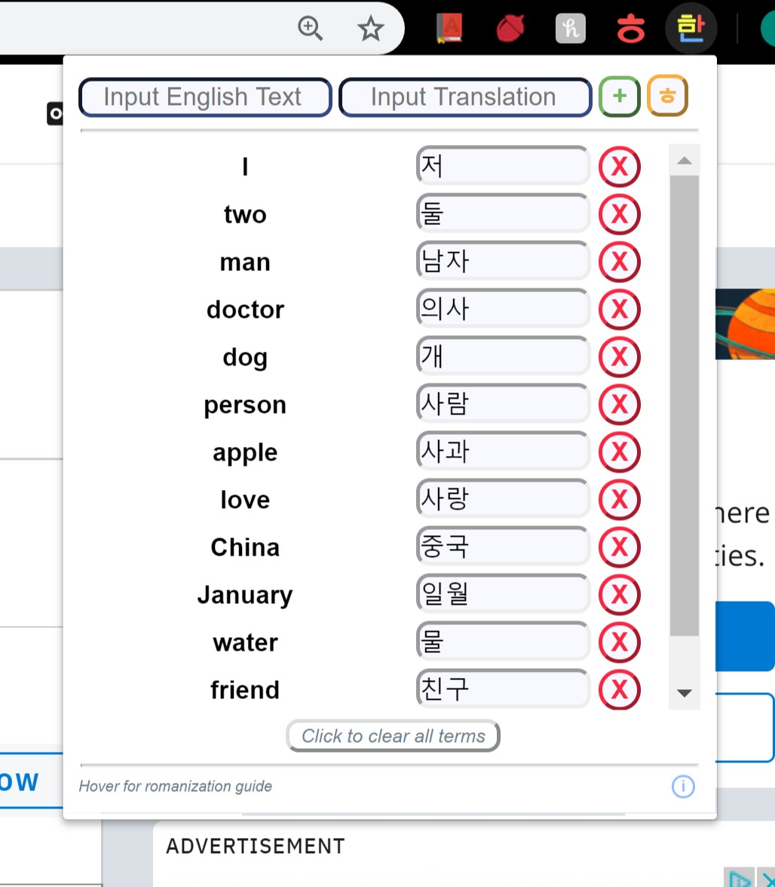

*A chrome extension meant to aid with memorizing korean vocabulary
words by replacing desired words with Korean translations that the user enters.*

##Overview
To select words to be replaced, click on the extension icon in Chrome.

English words can be entered in the left box and Korean translations can be
entered in the right box. Clicking the plus button will add this pair to your
list and replace all instances of this word in all open tabs with the
translation.

Users also have the option to type in romanized English into the translation
box and click the ㅎ button to convert to Korean letters. Only valid Korean
syllables will be converted, and any letters that are not properly 
romanized will not be changed. A romanization key can by viewed in the
extension by hovering over the text at the bottom of the popup.

To update the definition of the existing vocab word, enter the word into the
left box, enter the new translation into the right box, and then add the word.

To remove a vocab word from your list, press the X button next to the word.
To remove all words from your list, press the clear all button near the
bottom of the popup.

To view information about the extension, hover over the information button
in the bottom righthand corner of the popup.

Below is a sample image of what the popup looks like in use.

##Storage

All translation data is stored in the chrome local storage of your machine.
This means you can close chrome completely and your words will be accessible
whenever you next open chrome. The information is not synced to your chrome
account, so vocab words can only be viewed on the computer they were entered
on.

##Distribution

This extension is not currently available in the google chrome store, 
however it may be in the future. 
